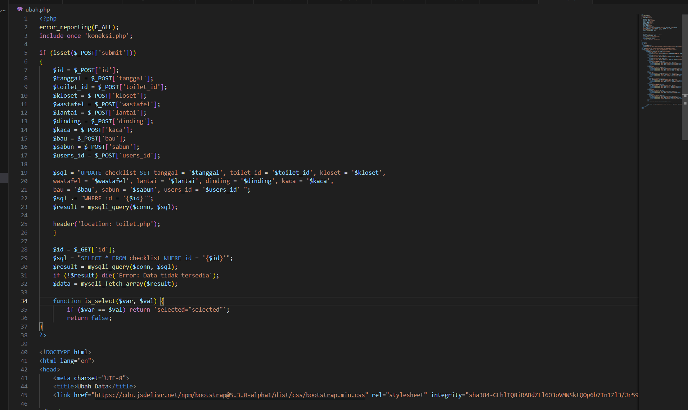
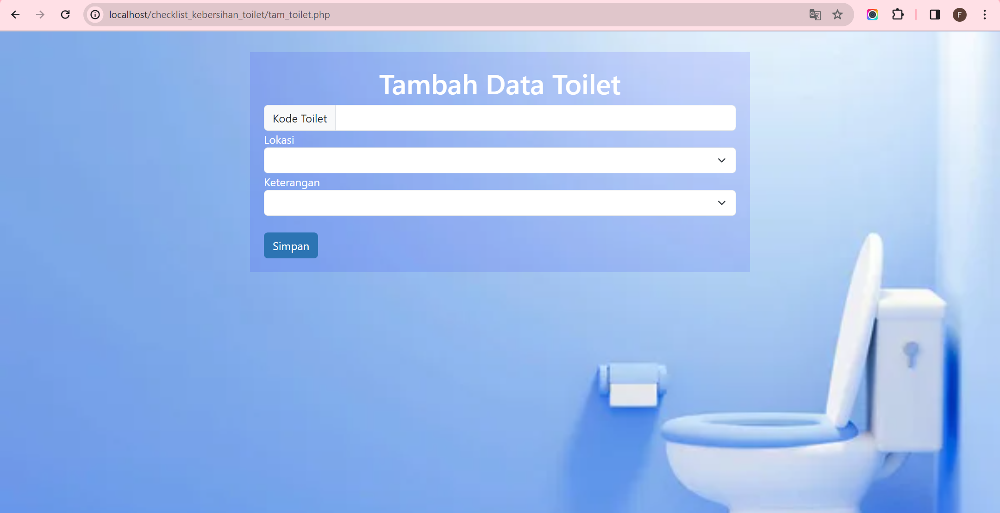

# Project_UAS

| NAMA  :| FEBRIYANI NURHIDA |
| --- | --- |
| NIM   :| 312210222 |
| KELAS :| TI.22.A2 |
| DOSEN :| Agung Nugroho,S.Kom.,M.Kom |

<Hr>

# Tugas Project Ujian Akhir Semester

**Sistem Checklist Kebersihan Toilet**<br>

|username :| admin  |
| --- | --- |
|password : | admin |
|link Web HOSTING DEMO : | https://zamband.000webhostapp.com/ |
|link youtube : | https://youtu.be/RDYL07F3y_4?si=seJ-drVnFA6q4efE |
| link drive pdf laporan : | https://drive.google.com/file/d/1_3so3xkoINlWq4A25snC-8dHInAa2np7/view?usp=sharing |


## Database Checklist Kebersihan Toilet


### SQL Checklist: users

```
CREATE TABLE IF NOT EXISTS `db_checklist`.`users` (
`id` INT NOT NULL AUTO_INCREMENT,
`username` VARCHAR(100) NULL,
`password` VARCHAR(100) NULL,
`nama` VARCHAR(200) NULL,
`email` VARCHAR(200) NULL,
`status` TINYINT(1) NULL,
`role` TINYINT(1) NULL DEFAULT 2 COMMENT '1:Admin\n2:User',
PRIMARY KEY (`id`),
UNIQUE INDEX `username_UNIQUE` (`username` ASC),
UNIQUE INDEX `email_UNIQUE` (`email` ASC))
ENGINE = InnoDB
```


### SQL Checklist: toilet

```
CREATE TABLE IF NOT EXISTS `mydb`.`toilet` (
`id` INT NOT NULL AUTO_INCREMENT,
`lokasi` VARCHAR(45) NULL,
`keterangan` VARCHAR(45) NULL,
PRIMARY KEY (`id`))
ENGINE = InnoDB
```


### SQL Checklist: checklist

```
CREATE TABLE IF NOT EXISTS `mydb`.`checklist` (
`id` INT NOT NULL AUTO_INCREMENT,
`tanggal` DATETIME NULL,
`toilet_id` INT NOT NULL,
`kloset` TINYINT(1) NULL,
`wastafel` TINYINT(1) NULL,
`lantai` TINYINT(1) NULL,
`dinding` TINYINT(1) NULL,
`kaca` TINYINT(1) NULL,
`bau` TINYINT(1) NULL,
`sabun` TINYINT(1) NULL,
`users_id` INT NOT NULL,
PRIMARY KEY (`id`),
INDEX `fk_checklist_toilet_idx` (`toilet_id` ASC),
INDEX `fk_checklist_users1_idx` (`users_id` ASC),
CONSTRAINT `fk_checklist_toilet`
FOREIGN KEY (`toilet_id`)
REFERENCES `mydb`.`toilet` (`id`)
ON DELETE NO ACTION
ON UPDATE NO ACTION,
CONSTRAINT `fk_checklist_users1`
FOREIGN KEY (`users_id`)
REFERENCES `mydb`.`users` (`id`)
ON DELETE NO ACTION
ON UPDATE NO ACTION)
ENGINE = InnoDB
```


## Membuat file Koneksi.php

```
<?php 
$host = "localhost"; 
$user = "root"; 
$pass = "";
$db = "toilet"; 

$conn = mysqli_connect($host, $user, $pass, $db);

if (!$conn) {
    die("Connection failed: " . mysqli_connect_error());
}
?>
```


## Membuat file Login.php

```
<?php
session_start();
$title = 'Login';
include_once 'koneksi.php';

if (isset($_POST['submit'])){
    $username = $_POST['username'];
    $password = $_POST['pass']; // Ganti pass menjadi password

    $sql = "SELECT * FROM users WHERE username = '{$username}' AND password = '{$password}'"; // Ganti pass menjadi password

    $result = mysqli_query($conn, $sql);
    if ($result && mysqli_affected_rows($conn) !=0){
        $_SESSION['login'] = true;
        $_SESSION['username'] = mysqli_fetch_array($result);

        header('location: home.php');
    } else {
        $errorMsg = "<p style=\"color:red;\">Gagal Login, silakan ulangi lagi.</p>";
    }
}
if (isset($errorMsg)) echo $errorMsg;
?>

<!DOCTYPE html>
<html lang="en">
<head>
    <meta charset="UTF-8">
    <title>Febriyani Nurhida UAS</title>
    <link href="https://cdn.jsdelivr.net/npm/bootstrap@5.3.0-alpha1/dist/css/bootstrap.min.css" rel="stylesheet" integrity="sha384-GLhlTQ8iRABdZLl6O3oVMWSktQOp6b7In1Zl3/Jr59b6EGGoI1aFkw7cmDA6j6gD" crossorigin="anonymous">
</head>
<body style="margin-top: 30px; background-image: url('toilet.jpg'); background-size: cover;">

<div class="container" style="width: 50%; padding: 20px; background-color: rgba(0, 0, 255, 0.1);">
    <h1 style="color: #FFFFFF; text-align: center;">DATA CHECKLIST KEBERSIHAN TOILET</h1><br>
    <h2 style="color: #FFFFFF; text-align: center;">LOGIN</h2><br>
    <form method="POST">
        <div class="mb-3 row" style="background-color: #87CEEB;">
            <label for="staticEmail" class="col-sm-2 col-form-label" style="color: #FFFFFF;">Username</label>
            <div class="col-sm-10">
                <input style="color: #000000;" type="text" class="form-control" id="staticEmail" placeholder="Username" name="username">
            </div>
        </div>
        <br>
        <div class="mb-3 row " style="background-color: #87CEEB;">
            <label for="inputPassword" class="col-sm-2 col-form-label" style="color: #FFFFFF;">Password</label>
            <div class="col-sm-10">
                <input type="password" class="form-control" id="inputPassword" placeholder="Password" accept="" name="pass">
            </div>
        </div>
        <br>
        <div class="submit">
            <button type="submit" name="submit" class="btn" style="background-color: #87CEEB; color: #FFFFFF;">Login</button>
        </div>
        <div><br><br>
            <p style="color: white;">Belum memiliki akun ?</p>
            <a href="tam_login.php" style="color: white;">Buat Akun Baru</a>
        </div>
    </form>
</div>
</body>
</html>

```


output


## Membuat file login_session.php

```
<?php

session_start();

if (!isset($_SESSION['isLogin']))
header('location: login.php');

?>
```


## Membuat file tam_login.php
```
<?php
error_reporting(E_ALL);

$host = "localhost";
$user = "root";
$pass = "";
$db = "toilet";
$conn = mysqli_connect($host, $user, $pass, $db);

if (!$conn) {
    die("Connection failed: " . mysqli_connect_error());
}

if (isset($_POST['submit'])) {
    $username = mysqli_real_escape_string($conn, $_POST['username']);
    $password = mysqli_real_escape_string($conn, $_POST['pass']);
    $nama = mysqli_real_escape_string($conn, $_POST['nama']);
    $email = mysqli_real_escape_string($conn, $_POST['email']);
    $status = ($_POST['stat'] == 'Aktif') ? 1 : 0; // Convert status to 1 for 'Aktif' and 0 for 'Nonaktif'
    $role = ($_POST['rol'] == 'Admin') ? 1 : 2; // Convert role to 1 for 'Admin' and 2 for 'User'

    $sql = "INSERT INTO users (username, password, nama, email, status, role) VALUES ('$username', '$password', '$nama', '$email', '$status', '$role')";
    
    $result = mysqli_query($conn, $sql);

    if ($result) {
        echo "Data berhasil disimpan ke dalam database.";
        header('location: index.php'); // Redirect to login.php after successful data insertion
    } else {
        echo "Error: " . mysqli_error($conn);
    }

    mysqli_close($conn);
}
?>

<!DOCTYPE html>
<html lang="en">
<head>
    <meta charset="UTF-8">
    <title>Tambah Akun</title>
    <link href="https://cdn.jsdelivr.net/npm/bootstrap@5.3.0-alpha1/dist/css/bootstrap.min.css" rel="stylesheet" integrity="sha384-GLhlTQ8iRABdZLl6O3oVMWSktQOp6b7In1Zl3/Jr59b6EGGoI1aFkw7cmDA6j6gD" crossorigin="anonymous">
</head>
<body style="margin-top: 30px; background-image: url('toilet.jpg'); background-size: cover;">
<div class="container" style="width: 50%; padding: 20px; background-color: rgba(0, 0, 255, 0.1);">
        <h1 style="color: #FFFFFF; text-align: center;">Tambah Akun</h1>
        <div class="main">
            <form method="post" action="tam_login.php" enctype="multipart/form-data">    
                <div class="input-group input-group-sm mb-3">
                <span class="input-group-text" id="inputGroup-sizing-sm">Username</span>
                    <input type="text" name="username" class="form-control" aria-label="Sizing example input" aria-describedby="inputGroup-sizing-sm">
                </div>
                <div class="input-group input-group-sm mb-3">
                <span class="input-group-text" id="inputGroup-sizing-sm">Password</span>
                    <input type="password" name="pass" class="form-control" aria-label="Sizing example input" aria-describedby="inputGroup-sizing-sm">
                </div>
                <div class="input-group input-group-sm mb-3">
                <span class="input-group-text" id="inputGroup-sizing-sm">Nama</span>
                    <input type="text" name="nama" class="form-control" aria-label="Sizing example input" aria-describedby="inputGroup-sizing-sm">
                </div>
                <div class="input-group input-group-sm mb-3">
                <span class="input-group-text" id="inputGroup-sizing-sm">E-mail</span>
                    <input type="text" name="email" class="form-control" aria-label="Sizing example input" aria-describedby="inputGroup-sizing-sm">
                </div>
                <div class="">
                    <h6 style="color: #FFFFFF;">Status</h6>
                    <select class="form-select" aria-label="Default select example" name="stat">
                        <option value=""></option>
                        <option value="Aktif">Aktif</option>
                        <option value="Nonaktif">Non Aktif</option>
                    </select>
                </div><br>
                <div class="">
                    <h6 style="color: #FFFFFF;">Role</h6>
                    <select class="form-select" aria-label="Default select example" name="rol">
                        <option value=""></option>
                        <option value="Admin">Admin</option>
                        <option value="User">User</option>
                    </select>
                </div> <br>
                <input type="submit" name="submit" value="Simpan" class= "btn" style="background-color: #2C74B3; color: #FFFFFF;">
            </form>
        </div>
    </div>
</body>
</html>
```


outputnya :


## Membuat file Home.php

```
<?php
session_start();
$title ='Home';
include_once 'koneksi.php';
?>

<!DOCTYPE html>
<html lang="en">
<head>
    <meta charset="UTF-8">
    <title>Febriyani Nurhida</title>
    <link href="style.css" rel="stylesheet" type="text/css" />
    <link href="https://cdn.jsdelivr.net/npm/bootstrap@5.3.0-alpha1/dist/css/bootstrap.min.css" rel="stylesheet" integrity="sha384-GLhlTQ8iRABdZLl6O3oVMWSktQOp6b7In1Zl3/Jr59b6EGGoI1aFkw7cmDA6j6gD" crossorigin="anonymous">

</head>
<body style="margin-top: 30px; background-image: url('bg.jpg'); background-size: cover;">
<h1 style="color: #6699CC; text-align: center; text-shadow: 2px 2px 4px rgba(255, 255, 255, 0.5);">SELAMAT DATANG DI APLIKASI CHECKLIST</h1>
    <div class="container" style="width: 70%; padding: 20px;">
        <ul class="list-group">
            <li class="list-group-item active text-center" aria-current="true" style="background-color: rgba(135, 206, 235, 0.2); font-size: 28px;">Menu</li>
            <li class="list-group-item text-center" style="background-color:rgba(135, 206, 235, 0.2); font-size: 30px;border-color: BLUE"><a style="color: #FFFFFF;" href="toilet.php">Checklist Toilet</a></li>
            <li class="list-group-item text-center" style="background-color:rgba(135, 206, 235, 0.2); font-size: 30px;border-color: BLUE;"><a style="color: #FFFFFF;" href="ind_toilet.php">Data Toilet</a></li>
        </ul>
    </div>
    <div class="d-grid gap-2 container" style="width:10%;">
        <button class="btn" type="button" style="background-color: #89CFF0"><a style="color: #FFFFFF" href="login.php">Logout</a></button>
    </div>
</body>
</html>
```


outputnya :


## Membuat file toilet.php

```
<?php
include("koneksi.php");

$q = "";
if (isset($_GET['submit']) && !empty($_GET['q'])) {
    $q = $_GET['q'];
    $sql_where = "WHERE tanggal LIKE '%".$q."%' or toilet_id LIKE '%".$q."%' or kloset LIKE '%".$q."%' or wastafel LIKE '%".$q."%' or lantai LIKE '%".$q."%' or dinding LIKE '%".$q."%' or sabun LIKE '%".$q."%' or bau LIKE '%".$q."%' or users_id LIKE '%".$q."%'" ;


}
$title = 'Checklist Toilet';
$sql = 'SELECT * FROM checklist ';
if (isset($sql_where))
    $sql .= $sql_where;
$result = mysqli_query($conn, $sql);
?>

<!DOCTYPE html>
<html lang="en">
<head>
    <meta charset="UTF-8">
    <title>Febriyani Nurhida UAS</title>
    <link href="style.css" rel="stylesheet" type="text/css" />
    <link href="https://cdn.jsdelivr.net/npm/bootstrap@5.3.0-alpha1/dist/css/bootstrap.min.css" rel="stylesheet" integrity="sha384-GLhlTQ8iRABdZLl6O3oVMWSktQOp6b7In1Zl3/Jr59b6EGGoI1aFkw7cmDA6j6gD" crossorigin="anonymous">

</head>
<body style="margin-top: 30px; background-image: url('wcc.jpg'); background-size: cover;">
<div class="container" style="width: 70%; padding: 20px; background-color: rgba(143, 145, 144, 0.2);">
        <br><br>
        <div class="head">
        <h1 style="color: #FFFFFF;">Checklist Toilet</h1>
        <form>
            <div class="form-group" action="toilet.php" method="get" >
                <label for="q" style="color: #FFFFFF;">Cari Data Toilet</label>
                <input type="text" placeholder="Masukkan Pencarian"  id="q" name="q" class="input-q" value="<?php echo $q ?>">
                <button type="submit" name="submit" class="btn btn-primary">Cari</button>
            </div>
        </form>
        </div>
        <div class="main">
            <table class="table table-striped table-hover">
            <tr>
                <th style="color: #FFFFFF;">Tanggal</th>
                <th style="color: #FFFFFF; width: 5%;">Kode Toilet</th>
                <th style="color: #FFFFFF;">Kloset</th>
                <th style="color: #FFFFFF;">Wastafel</th>
                <th style="color: #FFFFFF;">Lantai</th>
                <th style="color: #FFFFFF;">Dinding</th>
                <th style="color: #FFFFFF;">Kaca</th>
                <th style="color: #FFFFFF;">Bau</th>
                <th style="color: #FFFFFF;">Sabun</th>
                <th style="color: #FFFFFF;">Petugas</th>
                <th style="color: #FFFFFF; width: 5%;">ID Barang</th>
                <th style="color: #FFFFFF;">Aksi</th>
            </tr>
            <?php if($result): ?>
            <?php while($row = mysqli_fetch_assoc($result)): ?>
            <tr>
                <td style="color: #FFFFFF;"><?= $row['tanggal'];?></td>
                <td style="color: #FFFFFF;"><?= $row['toilet_id'];?></td>
                <td style="color: #FFFFFF;"><?= $row['kloset'];?></td>
                <td style="color: #FFFFFF;"><?= $row['wastafel'];?></td>
                <td style="color: #FFFFFF;"><?= $row['lantai'];?></td>
                <td style="color: #FFFFFF;"><?= $row['dinding'];?></td>
                <td style="color: #FFFFFF;"><?= $row['kaca'];?></td>
                <td style="color: #FFFFFF;"><?= $row['bau'];?></td>
                <td style="color: #FFFFFF;"><?= $row['sabun'];?></td>
                <td style="color: #FFFFFF;"><?= $row['users_id'];?></td>
                <td style="color: #FFFFFF;"><?= $row['id'];?></td>
                <td style="color: #FFFFFF;">
                    <button class="btn" type="button"><a style="color: #FFFFFF;" href="ubah.php?id=<?= $row['id'];?>">Ubah Data</a></button> 
                    <button class="btn" type="button"><a style="color: RED;" href="hapus.php?id=<?= $row['id'];?>">Hapus Data</a></button>
                </td>
            </tr>
            <?php endwhile; else: ?>
            <tr>
                <td style="color: #7eeef3;" colspan="7">Belum ada data</td>
            </tr>
            <?php endif; ?>
            </table>
        </div><br><br><br>
        <div>
        <button class="btn" type="button"><a style="color: #FFFFFF" href="tambah.php">Tambah Data Checklist</a></button>
        </div> <br>
        <div>
        <button class="btn" type="button"><a style="color: #FFFFFF" href="home.php">Kembali</a></button>
        </div>
    </div>
</body>
</html>
```


outputnya:


## Membuat file tambah.php

```
<?php
error_reporting(E_ALL);
include_once 'koneksi.php';

if (isset($_POST['submit']))
{
    $tanggal = $_POST['tanggal'];
    $toilet_id = $_POST['toilet_id'];
    $kloset = $_POST['kloset'];
    $wastafel = $_POST['wastafel'];
    $lantai = $_POST['lantai'];
    $dinding = $_POST['dinding'];
    $kaca = $_POST['kaca'];
    $bau = $_POST['bau'];
    $sabun = $_POST['sabun'];
    $users_id = $_POST['users_id'];

    $sql = 'INSERT INTO checklist (tanggal, toilet_id, kloset, wastafel, lantai, dinding, kaca, bau, sabun, users_id) ';
    $sql .= "VALUES ('{$tanggal}', '{$toilet_id}', '{$kloset}', '{$wastafel}', '{$lantai}', '{$dinding}', '{$kaca}', '{$bau}', '{$sabun}', '{$users_id}')";
    $result = mysqli_query($conn, $sql);
    header('location: toilet.php');
}
?>


<!DOCTYPE html>
<html lang="en">
<head>
    <meta charset="UTF-8">
    <title>Tambah Data</title>
    <link href="https://cdn.jsdelivr.net/npm/bootstrap@5.3.0-alpha1/dist/css/bootstrap.min.css" rel="stylesheet" integrity="sha384-GLhlTQ8iRABdZLl6O3oVMWSktQOp6b7In1Zl3/Jr59b6EGGoI1aFkw7cmDA6j6gD" crossorigin="anonymous">

</head>
<body style="margin-top: 30px; background-image: url('toilet.jpg'); background-size: cover;">
<div class="container" style="width: 50%; padding: 20px; background-color: rgba(0, 0, 255, 0.1);">

        <h1 style="color: #FFFFFF; text-align: center;">Tambah Data</h1>
        <div class="main">
            <form method="post" action="tambah.php" enctype="multipart/form-data">
                <div class="input-group">
                    <span class="input-group-text">Tanggal</span>
                    <input class="form-control" type="date" name="tanggal" data-date-format="DD/MMM/YYYY" placeholder="dd/mm/yyyy">
                </div><br>
                <div class="input-group">
                    <span class="input-group-text">Kode Toilet</span>
                    <input class="form-control" type="text" name="toilet_id">
                </div><br>
                <div class="input-group">
                    <span class="input-group-text">Kode Petugas</span>
                    <input class="form-control" type="text" name="users_id">
                </div>  
                <div class="input">
                    <label style="color: #FFFFFF;">Kloset</label>
                    <select class="form-select" aria-label="Default select example" name="kloset">
                        <option value=""></option>
                        <option value="Bersih">Bersih</option>
                        <option value="Kotor">Kotor</option>
                        <option value="Rusak">Rusak</option>
                    </select>
                </div>
                <div class="input">
                    <label style="color: #FFFFFF;">Wastafel</label>
                    <select class="form-select" aria-label="Default select example" name="wastafel">
                        <option value=""></option>
                        <option value="Bersih">Bersih</option>
                        <option value="Kotor">Kotor</option>
                        <option value="Rusak">Rusak</option>
                    </select>
                </div>
                <div class="input">
                    <label style="color: #FFFFFF;">Lantai</label>
                    <select class="form-select" aria-label="Default select example" name="lantai">
                        <option value=""></option>
                        <option value="Bersih">Bersih</option>
                        <option value="Kotor">Kotor</option>
                        <option value="Rusak">Rusak</option>
                    </select>
                </div>
                <div class="input">
                    <label style="color: #FFFFFF;">Dinding</label>
                    <select class="form-select" aria-label="Default select example" name="dinding">
                        <option value=""></option>
                        <option value="Bersih">Bersih</option>
                        <option value="Kotor">Kotor</option>
                        <option value="Rusak">Rusak</option>
                    </select>
                </div>
                <div class="input">
                    <label style="color: #FFFFFF;">Kaca</label>
                    <select class="form-select" aria-label="Default select example" name="kaca">
                        <option value=""></option>
                        <option value="Bersih">Bersih</option>
                        <option value="Kotor">Kotor</option>
                        <option value="Rusak">Rusak</option>
                    </select>
                </div>
                <div class="input">
                    <label style="color: #FFFFFF;">Bau</label>
                    <select class="form-select" aria-label="Default select example" name="bau">
                        <option value=""></option>
                        <option value="Ya">Ya</option>
                        <option value="Tidak">Tidak</option>
                    </select>
                </div>
                <div class="input">
                    <label style="color: #FFFFFF;">Sabun</label>
                    <select class="form-select" aria-label="Default select example" name="sabun">
                        <option value=""></option>
                        <option value="Ada">Ada</option>
                        <option value="Habis">Habis</option>
                        <option value="Hilang">Hilang</option>
                    </select>
                </div><br>
                
                <input class= "btn" style="background-color: #2C74B3; color: #FFFFFF;" type="submit" name="submit" value="Simpan">
            </form>
        </div>
    </div>
</body>
</html>
```


outpunya :


## Membuat file ubah.php

```
<?php
error_reporting(E_ALL);
include_once 'koneksi.php';

if (isset($_POST['submit'])) 
{
    $id = $_POST['id'];
    $tanggal = $_POST['tanggal'];
    $toilet_id = $_POST['toilet_id'];
    $kloset = $_POST['kloset'];
    $wastafel = $_POST['wastafel'];
    $lantai = $_POST['lantai'];
    $dinding = $_POST['dinding'];
    $kaca = $_POST['kaca'];
    $bau = $_POST['bau'];
    $sabun = $_POST['sabun'];
    $users_id = $_POST['users_id'];

    $sql = "UPDATE checklist SET tanggal = '$tanggal', toilet_id = '$toilet_id', kloset = '$kloset', 
    wastafel = '$wastafel', lantai = '$lantai', dinding = '$dinding', kaca = '$kaca', 
    bau = '$bau', sabun = '$sabun', users_id = '$users_id' ";
    $sql .= "WHERE id = '{$id}'";
    $result = mysqli_query($conn, $sql);

    header('location: toilet.php');
    }

    $id = $_GET['id'];
    $sql = "SELECT * FROM checklist WHERE id = '{$id}'";
    $result = mysqli_query($conn, $sql);
    if (!$result) die('Error: Data tidak tersedia');
    $data = mysqli_fetch_array($result); 

    function is_select($var, $val) {
        if ($var == $val) return 'selected="selected"';
        return false;
}
?>

<!DOCTYPE html>
<html lang="en">
<head>
    <meta charset="UTF-8">
    <title>Ubah Data</title>
    <link href="https://cdn.jsdelivr.net/npm/bootstrap@5.3.0-alpha1/dist/css/bootstrap.min.css" rel="stylesheet" integrity="sha384-GLhlTQ8iRABdZLl6O3oVMWSktQOp6b7In1Zl3/Jr59b6EGGoI1aFkw7cmDA6j6gD" crossorigin="anonymous">

</head>
<body style="margin-top: 30px; background-image: url('toilet.jpg'); background-size: cover;">
<div class="container" style="width: 50%; padding: 20px; background-color: rgba(0, 0, 255, 0.1);">
        <h1 style="color: #FFFFFF; text-align: center;">Ubah Data</h1>
        <div class="main">
            <form method="post" action="ubah.php" enctype="multipart/form-data">
                <div class="input-group">
                    <span class="input-group-text">Tanggal</span>
                    <input class="form-control" type="date" name="tanggal" data-date-format="DD/MMM/YYYY" placeholder="dd/mm/yyyy" value = "<?php echo $data['tanggal'];?>"/>
                </div><br>
                <div class="input-group">
                    <span class="input-group-text">Kode Toilet</span>
                    <input class="form-control" type="text" name="toilet_id" value="<?php echo $data['toilet_id'];?>"/>
                </div><br>
                <div class="input-group">
                    <span class="input-group-text">Kode Petugas</span>
                    <input class="form-control" type="text" name="users_id" value="<?php echo $data['users_id'];?>"/>
                </div><br>
                <div class="input">
                    <label style="color: #FFFFFF;">Kloset</label>
                    <select class="form-select" aria-label="Default select example" name="kloset">
                        <option <?php echo is_select ('Bersih', $data['kloset']);?> value="Bersih">Bersih</option>
                        <option <?php echo is_select ('Kotor', $data['kloset']);?> value="Kotor">Kotor</option>
                        <option <?php echo is_select ('Rusak', $data['kloset']);?> value="Rusak">Rusak</option>
                    </select>
                </div>
                <div class="input">
                    <label style="color: #FFFFFF;">Wastafel</label>
                    <select class="form-select" aria-label="Default select example" name="wastafel">
                        <option <?php echo is_select ('Bersih', $data['wastafel']);?> value="Bersih">Bersih</option>
                        <option <?php echo is_select ('Kotor', $data['wastafel']);?> value="Kotor">Kotor</option>
                        <option <?php echo is_select ('Rusak', $data['wastafel']);?> value="Rusak">Rusak</option>
                    </select>
                </div>
                <div class="input">
                    <label style="color: #FFFFFF;">Lantai</label>
                    <select class="form-select" aria-label="Default select example" name="lantai">
                        <option <?php echo is_select ('Bersih', $data['lantai']);?> value="Bersih">Bersih</option>
                        <option <?php echo is_select ('Kotor', $data['lantai']);?> value="Kotor">Kotor</option>
                        <option <?php echo is_select ('Rusak', $data['lantai']);?> value="Rusak">Rusak</option>
                    </select>
                </div>
                <div class="input">
                    <label style="color: #FFFFFF;">Dinding</label>
                    <select class="form-select" aria-label="Default select example" name="dinding">
                        <option <?php echo is_select ('Bersih', $data['dinding']);?> value="Bersih">Bersih</option>
                        <option <?php echo is_select ('Kotor', $data['dinding']);?> value="Kotor">Kotor</option>
                        <option <?php echo is_select ('Rusak', $data['dinding']);?> value="Rusak">Rusak</option>
                    </select>
                </div>
                <div class="input">
                    <label style="color: #FFFFFF;">Kaca</label>
                    <select class="form-select" aria-label="Default select example" name="kaca">
                        <option <?php echo is_select ('Bersih', $data['kaca']);?> value="Bersih">Bersih</option>
                        <option <?php echo is_select ('Kotor', $data['kaca']);?> value="Kotor">Kotor</option>
                        <option <?php echo is_select ('Rusak', $data['kaca']);?> value="Rusak">Rusak</option>
                    </select>
                </div>
                <div class="input">
                    <label style="color: #FFFFFF;">Bau</label>
                    <select class="form-select" aria-label="Default select example" name="bau">
                        <option <?php echo is_select ('Ya', $data['bau']);?> value="Ya">Ya</option>
                        <option <?php echo is_select ('Tidak', $data['bau']);?> value="Tidak">Tidak</option>
                    </select>
                </div>
                <div class="input">
                    <label style="color: #FFFFFF;">Sabun</label>
                    <select class="form-select" aria-label="Default select example" name="sabun">
                        <option <?php echo is_select ('Ada', $data['sabun']);?> value="Ada">Ada</option>
                        <option <?php echo is_select ('Habis', $data['sabun']);?> value="Habis">Habis</option>
                        <option <?php echo is_select ('Hilang', $data['sabun']);?> value="Hilang">Hilang</option>
                    </select>
                </div>
                <div>

                <input type="hidden" name="id" value="<?php echo $data['id'];?>">
                

                <input class= "btn" style="background-color: #2C74B3; color: #FFFFFF;" type="submit" name="submit" value="Simpan">
                </div>
            </form>
        </div>
    </div>
</body>
</html>
```




outputnya:


## Membuat file hapus.php

```
<?php
include_once 'koneksi.php';
$id = $_GET['id'];
$sql = "DELETE FROM checklist WHERE id = '{$id}'";
$result = mysqli_query($conn, $sql);
header('location: toilet.php');
?>
```


## Membuat file ind_toilet.php

```
<?php
include("koneksi.php");

$q = "";
if (isset($_GET['submit']) && !empty($_GET['q'])) {
    $q = $_GET['q'];
    $sql_where = "WHERE keterangan LIKE '%".$q."%' or lokasi LIKE '%".$q."%'";
}
$title = 'Toilet';
$sql = 'SELECT * FROM toilet ';
if (isset($sql_where))
    $sql .= $sql_where;
$result = mysqli_query($conn, $sql);
?>

<!DOCTYPE html>
<html lang="en">
<head>
    <meta charset="UTF-8">
    <title>Febriyani Nurhida UAS</title>
    <link href="style.css" rel="stylesheet" type="text/css" />
    <link href="https://cdn.jsdelivr.net/npm/bootstrap@5.3.0-alpha1/dist/css/bootstrap.min.css" rel="stylesheet" integrity="sha384-GLhlTQ8iRABdZLl6O3oVMWSktQOp6b7In1Zl3/Jr59b6EGGoI1aFkw7cmDA6j6gD" crossorigin="anonymous">

</head>
<body style="margin-top: 30px; background-image: url('wcc.jpg'); background-size: cover;">
<div class="container" style="width: 70%; padding: 20px; background-color: rgba(143, 145, 144, 0.2);">
        <br><br>
        <div class="head">
        <h1 style="color: #FFFFFF;">Data Toilet</h1>
        <form>
            <div class="form-group" action="" method="get" >
                <label for="q" style="color: #FFFFFF;">Cari Data Toilet</label>
                <input type="text" placeholder="Masukkan Pencarian"  id="q" name="q" class="input-q" value="<?php echo $q ?>">
                <button type="submit" name="submit" class="btn btn-primary">Cari</button>
            </div>
        </form>
        </div>
        <div class="main">
            <table class="table table-striped table-hover">
            <tr>
                <th style="color: #FFFFFF;">Kode Toilet</th>
                <th style="color: #FFFFFF;">Lokasi Toilet</th>
                <th style="color: #FFFFFF;">Keterangan</th>
                <th style="color: #FFFFFF;">Aksi</th>
            </tr>
            <?php if($result): ?>
            <?php while($row = mysqli_fetch_array($result)): ?>
            <tr>
                <td style="color: #FFFFFF;"><?= $row['id'];?></td>
                <td style="color: #FFFFFF;"><?= $row['lokasi'];?></td>
                <td style="color: #FFFFFF;"><?= $row['keterangan'];?></td>
                <td style="color: #FFFFFF;">
                    <button class="btn" type="button"><a style="color: RED;" href="hap_toilet.php?id=<?= $row['id'];?>">Hapus Data</a></button>
                </td>
            </tr>
            <?php endwhile; else: ?>
            <tr>
                <td style="color: #FFFFFF;" colspan="7">Belum ada data</td>
            </tr>
            <?php endif; ?>
            </table>
        </div><br><br><br>
        <div>
        <button class="btn" type="button"><a style="color: #FFFFFF" href="tam_toilet.php">Tambah Data Toilet</a></button>
        </div> <br>
        <div>
        <button class="btn" type="button"><a style="color: #FFFFFF" href="home.php">Kembali</a></button>
        </div>
    </div>
</body>
</html>
```


outputnya:


## Mmembuat file tam_toilet.php

```
<?php
error_reporting(E_ALL);
include_once 'koneksi.php';

if (isset($_POST['submit']))
{
    $toilet_id = $_POST['toilet_id'];
    $lokasi = $_POST['lokasi'];
    $keterangan = $_POST['keterangan'];

    $sql = 'INSERT INTO toilet (id, lokasi, keterangan) ';
    $sql .= "VALUE ('{$toilet_id}', '{$lokasi}', '{$keterangan}')";
    $result = mysqli_query($conn, $sql);
    header('location: ind_toilet.php');
}
?>

<!DOCTYPE html>
<html lang="en">
<head>
    <meta charset="UTF-8">
    <title>Febriyani Nurhida UAS</title>
    <link href="https://cdn.jsdelivr.net/npm/bootstrap@5.3.0-alpha1/dist/css/bootstrap.min.css" rel="stylesheet" integrity="sha384-GLhlTQ8iRABdZLl6O3oVMWSktQOp6b7In1Zl3/Jr59b6EGGoI1aFkw7cmDA6j6gD" crossorigin="anonymous">

</head>
<body style="margin-top: 30px; background-image: url('toilet.jpg'); background-size: cover;">
<div class="container" style="width: 50%; padding: 20px; background-color: rgba(0, 0, 255, 0.1);">
        <h1 style="color: #FFFFFF; text-align: center;">Tambah Data Toilet</h1>
        <div class="main">
            <form method="post" action="tam_toilet.php" enctype="multipart/form-data">
                <div class="input-group">
                    <span class="input-group-text">Kode Toilet</span>
                    <input class="form-control" type="text" name="toilet_id">
                </div>
                <div class="input">
                    <label style="color: #FFFFFF;">Lokasi</label>
                    <select class="form-select" aria-label="Default select example" name="lokasi">
                        <option value=""></option>
                        <option value="Office">Office</option>
                        <option value="Factory 1">Factory 1</option>
                        <option value="Factory 2">Factory 2</option>
                        <option value="Security">Security</option>
                    </select>
                </div>
                <div class="input">
                    <label style="color: #FFFFFF;">Keterangan</label>
                    <select class="form-select" aria-label="Default select example" name="keterangan">
                        <option value=""></option>
                        <option value="Sudah">Sudah</option>
                        <option value="Belum">Belum</option>
                    </select>
                </div> <br>
                <input class= "btn" style="background-color: #2C74B3; color: #FFFFFF;" type="submit" name="submit" value="Simpan">
            </form>
        </div>
    </div>
</body>
</html>
```


outputnya :




## Membuat file hap_toilet.php

```
<?php
include_once 'koneksi.php';
$id = $_GET['id'];
$sql = "DELETE FROM toilet WHERE id = '{$id}'";
$result = mysqli_query($conn, $sql);
header('location: ind_toilet.php');
?>
```


# Sekian, selamat libur semester
